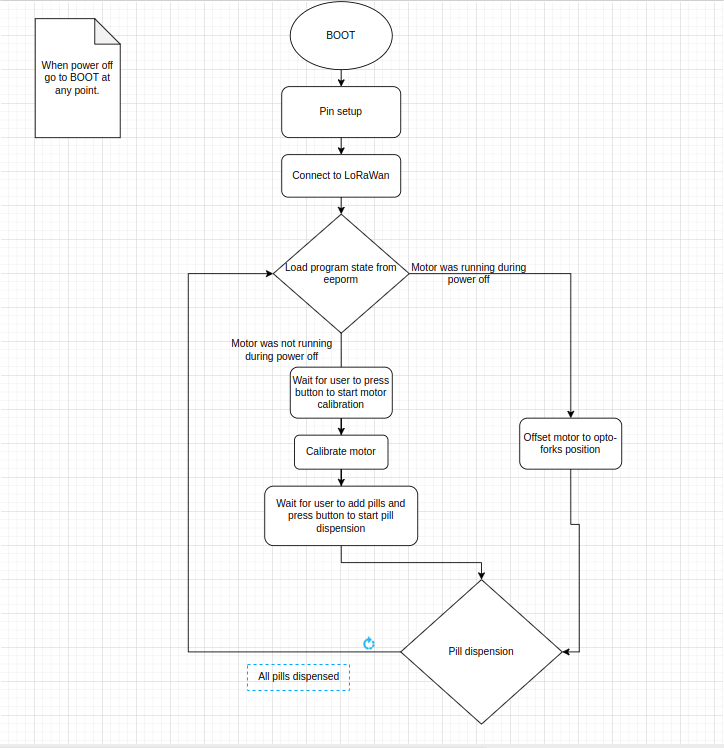

# Pill Dispenser a REVOLUTIONARY medical device

## Introduction

### Projects goals
* The goal of the project is to have a device that dispenses the user a pill once a day
* The device waits for user to start calibration and after calibration to load the pills after the user has loaded pill and pressed the button it starts dispensing the pills
* The device checks that the pill has been dispensed and if no pill has been dispensed it provides the user feedback trough the led and tries again until a pill is dispensed or its empty

### The value of our project
* It helps people remember to take their medication by giving it straight to them
* The device could be especially useful in context of elderly care

## Description of software
* **1. Boot**
  * Initialises all pins and connections
  * Tries connecting to lorawan network
  * Loads program state from eeprom
* **2. Main program**
  * Checks if program was reset mid turning and if so resets to the correct position
  * Checks if program has been calibrated
    * If hasnt been calibrated waits for user to press button before calibrating
  * Waits for user to load pills and press start button
* **3. Pill dispense loop**
  * Turns one slot forwared then waits for 1.5s for a pill to drop
    * If no pill was dropped it tries again until a pill is dropped or its empty
  * If last pill is dispensed program goes back to step 2. and recalibrates

## Flow chart of software

## Work divided
  * Teo Maximilien
    * stepper motor logic
    * program state and eeprom logic
    * pill dispening logic
    * Documentation
  * Aleksi Noro
    * lorawan
    * main program logic at start
    * Documentation
  * Pavel Lehto
    * Modified and improved certain sections of code logic
    * Documentation
